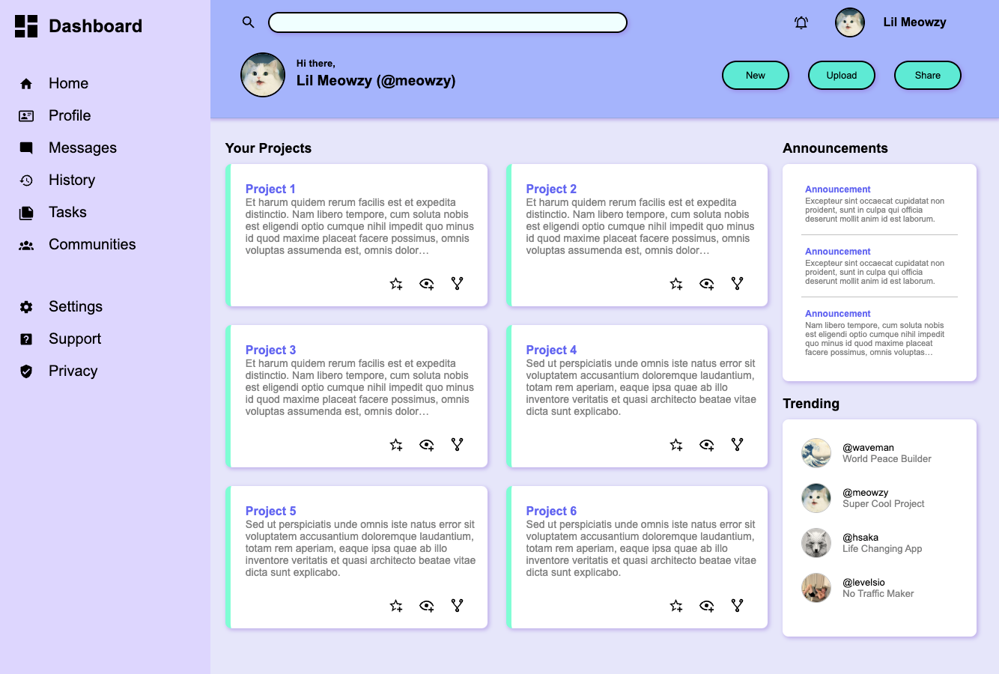

# odin-admin-dashboard

The aim of this project was to build a dashboard based on the prescribed design, with a focus on using CSS Grid to create the layout.

https://www.theodinproject.com/lessons/node-path-intermediate-html-and-css-admin-dashboard

## Screenshots

## What I learned from this project

How to build complex layouts by combining CSS Grid and Flexbox.
